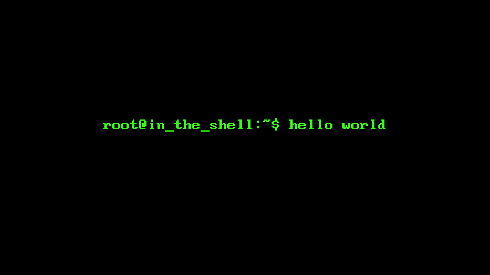

*hello there*

### Hello there 👋

- 🔭 I’m currently stuck_in_the_shell.
- 👯 I’m looking to collaborate on open source projects.
- 💬 I’m want to help people starting with Linux.
- ⚡ Fun fact: Type  `:qa`  and press `<Enter>` to exit Vim.

<!--
**inatagan/inatagan** is a ✨ _special_ ✨ repository because its `README.md` (this file) appears on your GitHub profile.

Here are some ideas to get you started:

- 🔭 I’m currently working on ...
- 🌱 I’m currently learning ...
- 👯 I’m looking to collaborate on ...
- 🤔 I’m looking for help with ...
- 💬 Ask me about ...
- 📫 How to reach me: ...
- 😄 Pronouns: ...
- ⚡ Fun fact: ...
-->
